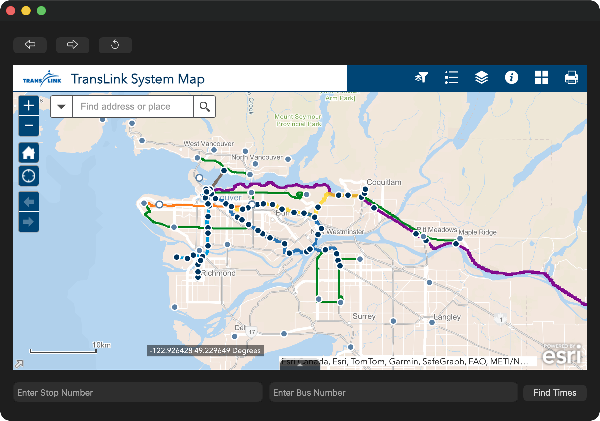
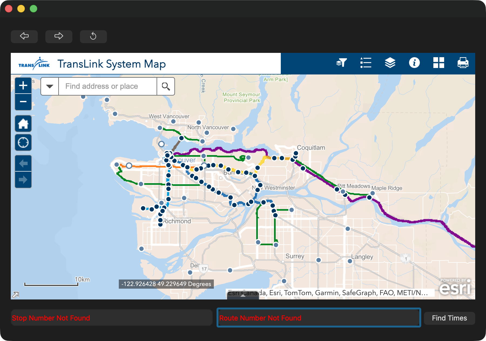
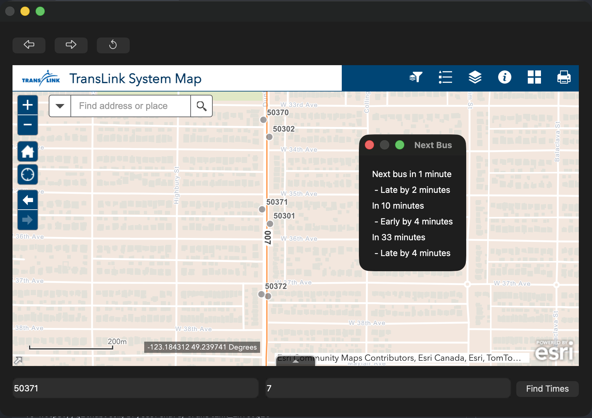

# TransLink Info

Desktop application for viewing live TransLink bus arrival information using the GTFS Realtime API.

> #### In progress, currently has very minimal functionality
## Features

- Live bus arrival estimates

- Route and stop lookup

- PySide6 desktop GUI

- GTFS static data parsing

- GTFS realtime integration

- Local JSON caching for faster lookups

## Technologies

- Python

- PySide6

- Requests

- GTFS Realtime

- JSON

- CSV parsing

## TODO
> - #### Improve UI :white_check_mark:
> - #### Add icons :white_check_mark:
> - #### Add a searchable map implementation :white_check_mark:
> - #### View a given bus route on a map
> - #### Stretch goal: Create a basic route planner

## Screenshots




## Setup
```bash
python3.12 -m venv .translink_info
source .translink_info/bin/activate
pip install -r requirements.txt
```

## Running
```
python src/main.py
```